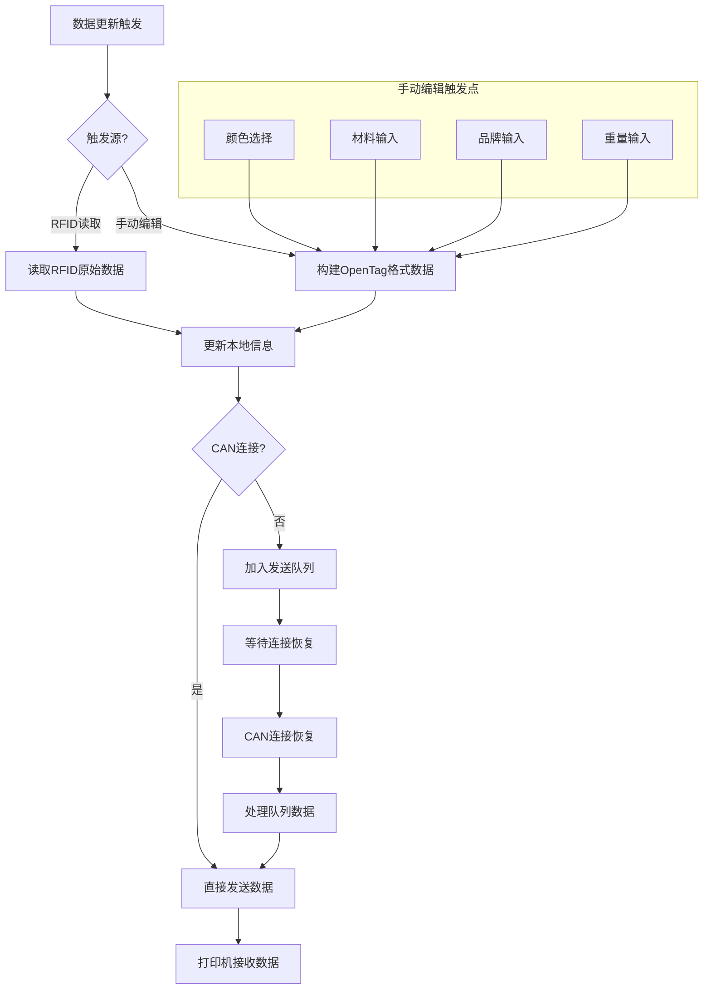

# RFID原始数据发送到打印机实现方案

## 1. 概述

本方案实现将RFID标签中的原始OpenTag数据完整发送给3D打印机。当读取到RFID信息时，系统会主动将原始数据发送给打印机。如果CAN连接正常，立即发送；如果CAN断开，数据将进入发送队列，等待连接恢复后自动发送。

## 2. 数据结构

### 2.1 OpenTag耗材数据结构

```c
typedef struct {
    /* 必需数据 */
    uint16_t tagVersion;              // 标签版本
    char manufacturer[16];            // 制造商
    char materialName[16];            // 材料名称
    char colorName[32];               // 颜色名称
    uint16_t diameterTarget;          // 目标直径(μm)
    uint16_t weightNominal;           // 标称重量(g)
    uint16_t printTemp;               // 打印温度(°C)
    uint16_t bedTemp;                 // 热床温度(°C)
    uint16_t density;                 // 密度(μg/cm³)
    
    /* 可选数据 */
    char serialNumber[16];            // 序列号
    uint32_t manufactureDate;         // 生产日期
    uint32_t manufactureTime;         // 生产时间
    uint8_t spoolCoreDiameter;        // 线轴芯直径
    uint8_t mfi;                      // 熔融指数
    uint8_t toleranceMeasured;        // 公差测量值
    char additionalDataUrl[32];       // 附加数据URL
    uint16_t emptySpoolWeight;        // 空线轴重量(g)
    uint16_t filamentWeightMeasured;  // 实测耗材重量(g)
    uint16_t filamentLengthMeasured;  // 实测耗材长度(m)
    uint16_t transmissionDistance;    // 传输距离
    uint32_t colorHex;                // 颜色十六进制值
    uint8_t maxDryTemp;               // 最大干燥温度(°C)
} OpenTag_FilamentData_t;
```

数据总大小：约148字节（考虑内存对齐）

### 2.2 CAN命令定义

```c
// 在message_enums.h中添加
#define CMD_RFID_RAW_DATA_NOTIFY     0x14  // 主动通知RFID原始数据（起始包）
#define CMD_RFID_RAW_DATA_REQUEST    0x15  // 请求RFID原始数据
#define CMD_RFID_RAW_DATA_RESPONSE   0x16  // RFID原始数据响应（起始包）
#define CMD_RFID_DATA_PACKET         0x17  // RFID数据包
#define CMD_RFID_DATA_END            0x18  // RFID数据传输结束
#define CMD_RFID_READ_ERROR          0x19  // RFID读取错误
```

## 3. 传输协议

### 3.1 协议概述

本协议设计用于在送料柜和3D打印机之间传输RFID原始数据。支持主动推送和被动查询两种模式，采用分包传输机制以适应CAN总线8字节的限制。

### 3.2 命令类型

| 命令码 | 命令名称 | 方向 | 说明 |
|--------|----------|------|------|
| 0x14 | CMD_RFID_RAW_DATA_NOTIFY | 送料柜→打印机 | 主动通知有新的RFID数据 |
| 0x15 | CMD_RFID_RAW_DATA_REQUEST | 打印机→送料柜 | 请求指定挤出机的RFID数据 |
| 0x16 | CMD_RFID_RAW_DATA_RESPONSE | 送料柜→打印机 | 响应查询请求的起始包 |
| 0x17 | CMD_RFID_DATA_PACKET | 送料柜→打印机 | 数据传输包 |
| 0x18 | CMD_RFID_DATA_END | 送料柜→打印机 | 数据传输结束包 |
| 0x19 | CMD_RFID_READ_ERROR | 送料柜→打印机 | 错误响应 |

### 3.3 数据包格式详解

#### 3.3.1 主动通知起始包 (CMD_RFID_RAW_DATA_NOTIFY)
```
字节 0: [0x14] - 命令码
字节 1: [序列号] - 消息序列号，用于匹配响应
字节 2: [耗材通道] - 耗材位置索引 (0-5)
字节 3: [总包数] - 数据分包总数
字节 4: [数据长度高] - 原始数据总长度高字节
字节 5: [数据长度低] - 原始数据总长度低字节
字节 6: [挤出机ID] - 映射的挤出机ID (0xFF表示无映射)
字节 7: [数据源] - 0x00:RFID读取, 0x01:手动输入
```

#### 3.3.2 查询请求包 (CMD_RFID_RAW_DATA_REQUEST)
```
字节 0: [0x15] - 命令码
字节 1: [序列号] - 消息序列号
字节 2: [挤出机ID] - 查询的挤出机ID
字节 3-7: [保留] - 填充0x00
```

#### 3.3.3 查询响应起始包 (CMD_RFID_RAW_DATA_RESPONSE)
```
字节 0: [0x16] - 命令码
字节 1: [序列号] - 消息序列号（与请求相同）
字节 2: [挤出机ID] - 响应的挤出机ID
字节 3: [总包数] - 数据分包总数
字节 4: [数据长度高] - 原始数据总长度高字节
字节 5: [数据长度低] - 原始数据总长度低字节
字节 6: [耗材通道] - 对应的耗材位置索引
字节 7: [数据源] - 0x00:RFID读取, 0x01:手动输入
```

#### 3.3.4 数据传输包 (CMD_RFID_DATA_PACKET)
```
字节 0: [0x17] - 命令码
字节 1: [序列号] - 消息序列号（与起始包相同）
字节 2: [包序号] - 当前包序号 (1-N)
字节 3: [有效字节数] - 本包中的有效数据字节数 (1-4)
字节 4-7: [数据] - 实际数据内容，未使用部分填充0x00
```

#### 3.3.5 传输结束包 (CMD_RFID_DATA_END)
```
字节 0: [0x18] - 命令码
字节 1: [序列号] - 消息序列号（与起始包相同）
字节 2: [总包数] - 确认的总包数
字节 3: [校验和高] - 所有数据字节累加和的高字节
字节 4: [校验和低] - 所有数据字节累加和的低字节
字节 5: [传输状态] - 0x00:成功, 0x01:部分失败
字节 6-7: [保留] - 填充0x00
```

#### 3.3.6 错误响应包 (CMD_RFID_READ_ERROR)
```
字节 0: [0x19] - 命令码
字节 1: [序列号] - 消息序列号
字节 2: [挤出机ID] - 相关的挤出机ID
字节 3: [错误码] - 错误类型
字节 4: [扩展错误码] - 详细错误信息
字节 5-7: [保留] - 填充0x00
```

### 3.4 错误码定义

#### 主错误码（字节3）
| 错误码 | 名称 | 说明 |
|--------|------|------|
| 0x01 | RFID_ERR_READ_FAIL | RFID读取失败 |
| 0x02 | RFID_ERR_NO_FILAMENT | 无耗材或未检测到 |
| 0x03 | RFID_ERR_INVALID_DATA | 数据格式无效 |
| 0x04 | RFID_ERR_TIMEOUT | 操作超时 |
| 0x05 | RFID_ERR_NO_MAPPING | 无挤出机映射 |
| 0x06 | RFID_ERR_BUSY | 系统忙，无法处理 |

#### 扩展错误码（字节4）
- 当主错误码为0x01时：
  - 0x01: UART通信错误
  - 0x02: 校验和错误
  - 0x03: 无RFID标签
  - 0x04: RFID认证失败

### 3.5 传输流程

#### 3.5.1 主动通知流程
```
送料柜                              打印机
  |                                   |
  |--CMD_RFID_RAW_DATA_NOTIFY------->|  (起始包)
  |                                   |
  |--CMD_RFID_DATA_PACKET----------->|  (数据包1)
  |<--延迟50ms--->                    |
  |--CMD_RFID_DATA_PACKET----------->|  (数据包2)
  |              ...                  |
  |--CMD_RFID_DATA_PACKET----------->|  (数据包N)
  |<--延迟50ms--->                    |
  |--CMD_RFID_DATA_END-------------->|  (结束包)
  |                                   |
```

#### 3.5.2 查询响应流程
```
打印机                              送料柜
  |                                   |
  |--CMD_RFID_RAW_DATA_REQUEST------>|
  |                                   |
  |<--CMD_RFID_RAW_DATA_RESPONSE-----|  (起始包)
  |                                   |
  |<--CMD_RFID_DATA_PACKET-----------|  (数据包)
  |              ...                  |
  |<--CMD_RFID_DATA_END--------------|  (结束包)
  |                                   |
```

### 3.6 数据完整性保证

1. **序列号机制**：每个传输会话使用唯一序列号，避免数据混淆
2. **包序号**：确保数据包按正确顺序接收
3. **校验和**：验证数据传输的完整性
4. **总包数确认**：起始包和结束包都包含总包数，确保没有丢包
5. **有效字节数**：每个数据包标明实际数据长度，避免解析错误

### 3.7 性能参数

| 参数 | 值 | 说明 |
|------|-----|------|
| 单包数据量 | 4字节 | CAN总线限制 |
| 包间隔 | 50ms | 避免总线拥塞 |
| 传输超时 | 5秒 | 整个传输会话超时 |
| 重试次数 | 3次 | 错误重试次数 |
| 队列大小 | 6 | 支持6个耗材通道 |
| 最大数据长度 | 256字节 | 支持扩展的OpenTag数据 |

### 3.8 兼容性考虑

1. **版本兼容**：预留字节可用于未来协议扩展
2. **数据源标识**：区分RFID读取和手动输入的数据
3. **错误扩展**：扩展错误码支持更详细的错误信息
4. **长度灵活**：支持不同长度的OpenTag数据格式

## 4. 实现代码

### 4.1 核心数据结构

```c
// 在canserial.h中添加
typedef struct {
    uint8_t active;                   // 传输是否激活
    uint8_t sequence;                 // 序列号
    uint8_t extruder_id;              // 挤出机ID
    uint8_t filament_id;              // 耗材通道ID
    uint8_t total_packets;            // 总包数
    uint8_t current_packet;           // 当前包序号
    uint16_t data_length;             // 数据总长度
    uint8_t data[sizeof(OpenTag_FilamentData_t)];  // 原始数据缓冲区
    uint32_t start_time;              // 开始时间（用于超时）
} RFID_Transfer_t;

// RFID数据发送队列
#define RFID_QUEUE_SIZE 6
typedef struct {
    uint8_t pending;                  // 是否有待发送数据
    uint8_t filament_id;              // 耗材通道ID
    uint8_t retry_count;              // 重试次数
    uint32_t timestamp;               // 加入队列时间
    uint8_t data[sizeof(OpenTag_FilamentData_t)];  // 原始数据
    uint16_t data_length;             // 数据长度
} RFID_Queue_Item_t;

static RFID_Transfer_t rfid_transfer = {0};
static RFID_Queue_Item_t rfid_queue[RFID_QUEUE_SIZE] = {0};
```

### 4.2 主动发送RFID原始数据

```c
// 在canserial.c中添加
// 主动发送RFID数据（读取到RFID后立即调用）
void send_rfid_data_proactive(uint8_t filament_id, uint8_t* raw_data, uint16_t data_len) {
    // 检查CAN连接状态
    if (canserial_get_connection_status() != CONN_STATUS_CONNECTED) {
        // CAN未连接，加入队列
        add_to_rfid_queue(filament_id, raw_data, data_len);
        return;
    }
    
    // 获取对应的挤出机ID
    uint8_t extruder_id = get_extruder_by_filament(filament_id);
    if (extruder_id == 0xFF) {
        return; // 无映射关系
    }
    
    // 初始化传输结构
    rfid_transfer.active = 1;
    rfid_transfer.sequence = canserial_get_next_seq();
    rfid_transfer.extruder_id = extruder_id;
    rfid_transfer.filament_id = filament_id;
    rfid_transfer.data_length = data_len;
    rfid_transfer.total_packets = (data_len + 3) / 4; // 向上取整
    rfid_transfer.current_packet = 0;
    rfid_transfer.start_time = HAL_GetTick();
    
    // 复制原始数据
    memcpy(rfid_transfer.data, raw_data, data_len);
    
    // 发送通知起始包
    uint8_t start_msg[8] = {0};
    start_msg[0] = CMD_RFID_RAW_DATA_NOTIFY;
    start_msg[1] = rfid_transfer.sequence;
    start_msg[2] = filament_id;
    start_msg[3] = rfid_transfer.total_packets;
    start_msg[4] = (rfid_transfer.data_length >> 8) & 0xFF;
    start_msg[5] = rfid_transfer.data_length & 0xFF;
    start_msg[6] = extruder_id;
    canserial_send_data(start_msg, 8);
    
    // 开始发送数据包
    send_next_rfid_packet();
}

// 添加到发送队列
static void add_to_rfid_queue(uint8_t filament_id, uint8_t* raw_data, uint16_t data_len) {
    // 查找空闲队列位置
    for (int i = 0; i < RFID_QUEUE_SIZE; i++) {
        if (!rfid_queue[i].pending) {
            rfid_queue[i].pending = 1;
            rfid_queue[i].filament_id = filament_id;
            rfid_queue[i].retry_count = 0;
            rfid_queue[i].timestamp = HAL_GetTick();
            rfid_queue[i].data_length = data_len;
            memcpy(rfid_queue[i].data, raw_data, data_len);
            return;
        }
    }
    // 队列满，覆盖最旧的
    uint32_t oldest_time = 0xFFFFFFFF;
    int oldest_index = 0;
    for (int i = 0; i < RFID_QUEUE_SIZE; i++) {
        if (rfid_queue[i].timestamp < oldest_time) {
            oldest_time = rfid_queue[i].timestamp;
            oldest_index = i;
        }
    }
    rfid_queue[oldest_index].pending = 1;
    rfid_queue[oldest_index].filament_id = filament_id;
    rfid_queue[oldest_index].retry_count = 0;
    rfid_queue[oldest_index].timestamp = HAL_GetTick();
    rfid_queue[oldest_index].data_length = data_len;
    memcpy(rfid_queue[oldest_index].data, raw_data, data_len);
}

// 处理发送队列
void process_rfid_queue(void) {
    // 检查CAN连接状态
    if (canserial_get_connection_status() != CONN_STATUS_CONNECTED) {
        return;
    }
    
    // 检查是否有正在进行的传输
    if (rfid_transfer.active) {
        return;
    }
    
    // 查找待发送项
    for (int i = 0; i < RFID_QUEUE_SIZE; i++) {
        if (rfid_queue[i].pending) {
            // 发送队列中的数据
            send_rfid_data_proactive(rfid_queue[i].filament_id, 
                                   rfid_queue[i].data, 
                                   rfid_queue[i].data_length);
            // 清除队列项
            rfid_queue[i].pending = 0;
            break; // 一次只处理一个
        }
    }
}
```

### 4.3 响应查询的发送函数

```c
// 在canserial.c中添加
void send_rfid_raw_data_to_printer(uint8_t extruder_id) {
    // 获取对应的耗材通道
    uint8_t filament_id = get_filament_by_extruder(extruder_id);
    if (filament_id == 0xFF) {
        send_rfid_error(extruder_id, 0x02); // 无耗材
        return;
    }
    
    // 读取RFID原始数据
    RFID_DataTypeDef rfid_data;
    uint8_t board_index = motor_board_index_queue[filament_id];
    
    if (RFID_ReadChannel(board_index, &rfid_data) != RFID_OK) {
        send_rfid_error(extruder_id, 0x01); // 读取失败
        return;
    }
    
    // 初始化传输结构
    rfid_transfer.active = 1;
    rfid_transfer.sequence = canserial_get_next_seq();
    rfid_transfer.extruder_id = extruder_id;
    rfid_transfer.filament_id = filament_id;
    rfid_transfer.data_length = rfid_data.dataLen;
    rfid_transfer.total_packets = (rfid_data.dataLen + 3) / 4; // 向上取整
    rfid_transfer.current_packet = 0;
    rfid_transfer.start_time = HAL_GetTick();
    
    // 复制原始数据
    memcpy(rfid_transfer.data, rfid_data.data, rfid_data.dataLen);
    
    // 发送起始包
    uint8_t start_msg[8] = {0};
    start_msg[0] = CMD_RFID_RAW_DATA_RESPONSE;
    start_msg[1] = rfid_transfer.sequence;
    start_msg[2] = extruder_id;
    start_msg[3] = rfid_transfer.total_packets;
    start_msg[4] = (rfid_transfer.data_length >> 8) & 0xFF;
    start_msg[5] = rfid_transfer.data_length & 0xFF;
    start_msg[6] = filament_id;
    canserial_send_data(start_msg, 8);
    
    // 开始发送数据包
    send_next_rfid_packet();
}

// 发送下一个数据包
static void send_next_rfid_packet(void) {
    if (!rfid_transfer.active || 
        rfid_transfer.current_packet >= rfid_transfer.total_packets) {
        // 发送结束包
        send_rfid_end_packet();
        return;
    }
    
    uint8_t packet[8] = {0};
    packet[0] = CMD_RFID_DATA_PACKET;
    packet[1] = rfid_transfer.sequence;
    packet[2] = ++rfid_transfer.current_packet;
    
    // 计算本包数据
    uint16_t offset = (rfid_transfer.current_packet - 1) * 4;
    uint8_t bytes_remaining = rfid_transfer.data_length - offset;
    uint8_t bytes_to_send = (bytes_remaining > 4) ? 4 : bytes_remaining;
    
    packet[3] = bytes_to_send;
    
    // 复制数据
    for (int i = 0; i < bytes_to_send; i++) {
        packet[4 + i] = rfid_transfer.data[offset + i];
    }
    
    canserial_send_data(packet, 8);
}

// 发送结束包
static void send_rfid_end_packet(void) {
    // 计算校验和
    uint16_t checksum = 0;
    for (int i = 0; i < rfid_transfer.data_length; i++) {
        checksum += rfid_transfer.data[i];
    }
    
    uint8_t end_msg[8] = {0};
    end_msg[0] = CMD_RFID_DATA_END;
    end_msg[1] = rfid_transfer.sequence;
    end_msg[2] = rfid_transfer.total_packets;
    end_msg[3] = (checksum >> 8) & 0xFF;
    end_msg[4] = checksum & 0xFF;
    
    canserial_send_data(end_msg, 8);
    
    // 清除传输状态
    rfid_transfer.active = 0;
}

// 发送错误响应
static void send_rfid_error(uint8_t extruder_id, uint8_t error_code) {
    uint8_t error_msg[8] = {0};
    error_msg[0] = CMD_RFID_READ_ERROR;
    error_msg[1] = canserial_get_next_seq();
    error_msg[2] = extruder_id;
    error_msg[3] = error_code;
    canserial_send_data(error_msg, 8);
}
```

### 4.4 处理请求和传输控制

```c
// 在handle_valid_message函数中添加
case CMD_RFID_RAW_DATA_REQUEST:
    {
        uint8_t extruder_id = data[2];
        send_rfid_raw_data_to_printer(extruder_id);
    }
    break;

// 在主循环中添加传输处理
void process_rfid_transfer(void) {
    // 处理正在进行的传输
    if (rfid_transfer.active) {
        // 检查超时（5秒）
        if (HAL_GetTick() - rfid_transfer.start_time > 5000) {
            rfid_transfer.active = 0;
            send_rfid_error(rfid_transfer.extruder_id, 0x04);
            return;
        }
        
        // 检查是否需要发送下一个包（50ms间隔）
        static uint32_t last_send_time = 0;
        if (HAL_GetTick() - last_send_time > 50) {
            send_next_rfid_packet();
            last_send_time = HAL_GetTick();
        }
    }
    
    // 处理发送队列
    process_rfid_queue();
}

// 在main.c主循环中调用
while (1) {
    // 其他处理...
    
    // 处理RFID传输和队列
    process_rfid_transfer();
    
    // 其他处理...
}
```

### 4.5 RFID读取成功后的处理

```c
// 修改rfid_protocol.c中的RFID_Read_Filament_Info函数
uint8_t RFID_Read_Filament_Info(uint8_t filament_id) {
    // 现有读取代码...
    
    if (result == RFID_OK) {
        // 解析OpenTag数据
        if (RFID_ParseOpenTagData(&tagData, &filamentData) == HAL_OK) {
            // 更新本地耗材信息
            update_filament_box_from_rfid(filament_id, 
                                        filamentData.materialName,
                                        filamentData.colorName,
                                        filamentData.manufacturer,
                                        filamentData.serialNumber,
                                        filamentData.emptySpoolWeight);
            
            // 新增：主动发送原始数据到打印机
            send_rfid_data_proactive(filament_id, rfid_data.data, rfid_data.dataLen);
            
            return 1; // 检测成功
        }
    }
    return 0; // 检测失败
}

// CAN连接恢复回调
void on_can_connection_restored(void) {
    // 连接恢复时，处理队列中的数据
    process_rfid_queue();
}
```

### 4.6 手动更新耗材信息后的处理

```c
// 构建手动输入数据的OpenTag格式
static void build_manual_opentag_data(uint8_t box_index, uint8_t* buffer, uint16_t* length) {
    OpenTag_FilamentData_t tag_data = {0};
    Filament* box = &filament_boxes[box_index];
    
    // 填充必需字段
    tag_data.tagVersion = 1;  // 版本1 (小端)
    strncpy(tag_data.manufacturer, box->manufacturer, sizeof(tag_data.manufacturer) - 1);
    strncpy(tag_data.materialName, box->material, sizeof(tag_data.materialName) - 1);
    
    // 将颜色枚举转换为颜色名称
    const char* color_name = get_color_name_by_enum(box->color);
    if (color_name) {
        strncpy(tag_data.colorName, color_name, sizeof(tag_data.colorName) - 1);
    }
    
    // 设置默认值（小端格式）
    tag_data.diameterTarget = 1750;  // 默认1.75mm
    tag_data.weightNominal = 1000;   // 默认1kg
    tag_data.printTemp = 210;        // 默认210°C
    tag_data.bedTemp = 60;           // 默认60°C
    tag_data.density = 1240;         // 默认密度
    
    // 可选字段
    strncpy(tag_data.serialNumber, box->serialNumber, sizeof(tag_data.serialNumber) - 1);
    tag_data.emptySpoolWeight = box->spool_weight;  // 小端
    
    // 未定义的可选字段设置为0xFF
    tag_data.manufactureDate = 0xFFFFFFFF;
    tag_data.manufactureTime = 0xFFFFFFFF;
    tag_data.spoolCoreDiameter = 0xFF;
    tag_data.mfi = 0xFF;
    tag_data.toleranceMeasured = 0xFF;
    memset(tag_data.additionalDataUrl, 0xFF, sizeof(tag_data.additionalDataUrl));
    tag_data.filamentWeightMeasured = 0xFFFF;
    tag_data.filamentLengthMeasured = 0xFFFF;
    tag_data.transmissionDistance = 0xFFFF;
    tag_data.colorHex = 0xFFFFFFFF;
    tag_data.maxDryTemp = 0xFF;
    
    // 复制到缓冲区
    memcpy(buffer, &tag_data, sizeof(tag_data));
    *length = sizeof(tag_data);
}

// 修改filamentBox.c中的各个设置函数，添加发送通知
HAL_StatusTypeDef set_filament_color(uint8_t box_index, uint16_t color) {
    if (box_index >= MAX_FILAMENT) {
        return HAL_ERROR;
    }
    
    filament_boxes[box_index].color = color;
    HAL_StatusTypeDef result = save_materials_to_flash();
    
    // 新增：构建并发送手动输入的数据
    if (result == HAL_OK) {
        uint8_t opentag_data[sizeof(OpenTag_FilamentData_t)];
        uint16_t data_len;
        build_manual_opentag_data(box_index, opentag_data, &data_len);
        send_rfid_data_proactive(box_index, opentag_data, data_len);
    }
    
    return result;
}

HAL_StatusTypeDef set_filament_type(uint8_t box_index, const char* material_str) {
    if (box_index >= MAX_FILAMENT) {
        return HAL_ERROR;
    }
    
    if (material_str != NULL) {
        strncpy(filament_boxes[box_index].material, material_str, 
                sizeof(filament_boxes[box_index].material) - 1);
        filament_boxes[box_index].material[sizeof(filament_boxes[box_index].material) - 1] = '\0';
    } else {
        filament_boxes[box_index].material[0] = '\0';
    }
    
    HAL_StatusTypeDef result = save_materials_to_flash();
    
    // 新增：构建并发送手动输入的数据
    if (result == HAL_OK) {
        uint8_t opentag_data[sizeof(OpenTag_FilamentData_t)];
        uint16_t data_len;
        build_manual_opentag_data(box_index, opentag_data, &data_len);
        send_rfid_data_proactive(box_index, opentag_data, data_len);
    }
    
    return result;
}

HAL_StatusTypeDef set_filament_manufacturer(uint8_t box_index, const char* manufacturer_str) {
    if (box_index >= MAX_FILAMENT) {
        return HAL_ERROR;
    }
    
    if (manufacturer_str != NULL) {
        strncpy(filament_boxes[box_index].manufacturer, manufacturer_str, 
                sizeof(filament_boxes[box_index].manufacturer) - 1);
        filament_boxes[box_index].manufacturer[sizeof(filament_boxes[box_index].manufacturer) - 1] = '\0';
    } else {
        filament_boxes[box_index].manufacturer[0] = '\0';
    }
    
    HAL_StatusTypeDef result = save_materials_to_flash();
    
    // 新增：构建并发送手动输入的数据
    if (result == HAL_OK) {
        uint8_t opentag_data[sizeof(OpenTag_FilamentData_t)];
        uint16_t data_len;
        build_manual_opentag_data(box_index, opentag_data, &data_len);
        send_rfid_data_proactive(box_index, opentag_data, data_len);
    }
    
    return result;
}

HAL_StatusTypeDef set_filament_spool_weight(uint8_t box_index, uint16_t spool_weight) {
    if (box_index >= MAX_FILAMENT) {
        return HAL_ERROR;
    }
    
    filament_boxes[box_index].spool_weight = spool_weight;
    HAL_StatusTypeDef result = save_materials_to_flash();
    
    // 新增：构建并发送手动输入的数据
    if (result == HAL_OK) {
        uint8_t opentag_data[sizeof(OpenTag_FilamentData_t)];
        uint16_t data_len;
        build_manual_opentag_data(box_index, opentag_data, &data_len);
        send_rfid_data_proactive(box_index, opentag_data, data_len);
    }
    
    return result;
}

// 获取颜色名称的辅助函数
const char* get_color_name_by_enum(uint8_t color_enum) {
    for (int i = 0; i < sizeof(color_map) / sizeof(color_map[0]); i++) {
        if (color_map[i].value == color_enum) {
            return color_map[i].name;
        }
    }
    return "Unknown";
}
```

## 5. 使用流程

### 5.1 主动发送流程（主要方式）

#### 5.1.1 RFID读取触发
1. 检测到新耗材插入或RFID读取触发
2. 读取RFID原始数据
3. 更新本地耗材信息
4. 检查CAN连接状态：
   - 如果已连接：立即发送原始数据到打印机
   - 如果未连接：数据加入发送队列
5. CAN连接恢复后，自动处理队列中的数据

#### 5.1.2 手动更新触发
1. 用户通过触摸屏编辑耗材信息
2. 系统保存更新的信息到Flash
3. 构建符合OpenTag格式的数据包
4. 检查CAN连接状态：
   - 如果已连接：立即发送构建的数据到打印机
   - 如果未连接：数据加入发送队列
5. CAN连接恢复后，自动处理队列中的数据

### 5.2 打印机查询流程（备用方式）

1. 打印机发送 `CMD_RFID_RAW_DATA_REQUEST`
2. 送料柜读取RFID数据或使用手动输入的数据
3. 发送响应数据包

### 5.3 手动更新触发点

1. **颜色更新**：用户在编辑页面选择颜色
2. **材料类型更新**：用户输入材料名称（如PLA、ABS等）
3. **品牌更新**：用户输入制造商名称
4. **线轴重量更新**：用户输入空线轴重量

每个更新操作都会：
- 保存数据到Flash存储器
- 构建OpenTag格式数据
- 主动发送给打印机

### 5.4 数据流程图



## 6. 数据缓存机制

### 6.1 缓存结构设计

为支持打印机随时查询历史RFID数据，系统需要缓存每个通道的最新RFID原始数据：

```c
// 在canserial.h中添加
typedef struct {
    uint8_t valid;                    // 数据是否有效
    uint8_t filament_id;              // 耗材通道ID(0-5)
    uint32_t timestamp;               // 数据更新时间戳
    uint8_t raw_data[256];            // 原始RFID数据
    uint16_t data_length;             // 数据长度
    uint8_t data_source;              // 数据来源: 0=RFID读取, 1=手动输入
} RFID_Cache_t;

// 全局缓存数组
static RFID_Cache_t rfid_cache[MAX_FILAMENT] = {0};
```

### 6.2 缓存更新函数

```c
// 更新缓存数据
void update_rfid_cache(uint8_t filament_id, uint8_t* data, uint16_t length, uint8_t source) {
    if (filament_id >= MAX_FILAMENT) return;
    
    RFID_Cache_t* cache = &rfid_cache[filament_id];
    cache->valid = 1;
    cache->filament_id = filament_id;
    cache->timestamp = HAL_GetTick();
    cache->data_length = (length > 256) ? 256 : length;
    memcpy(cache->raw_data, data, cache->data_length);
    cache->data_source = source;
}

// 获取缓存数据
HAL_StatusTypeDef get_cached_rfid_data(uint8_t filament_id, uint8_t* buffer, uint16_t* length) {
    if (filament_id >= MAX_FILAMENT || !buffer || !length) {
        return HAL_ERROR;
    }
    
    RFID_Cache_t* cache = &rfid_cache[filament_id];
    if (!cache->valid) {
        return HAL_ERROR;  // 无有效数据
    }
    
    memcpy(buffer, cache->raw_data, cache->data_length);
    *length = cache->data_length;
    return HAL_OK;
}

// 清除缓存
void clear_rfid_cache(uint8_t filament_id) {
    if (filament_id < MAX_FILAMENT) {
        rfid_cache[filament_id].valid = 0;
    }
}
```

### 6.3 缓存集成

在主动发送函数中集成缓存更新：

```c
void send_rfid_data_proactive(uint8_t filament_id, uint8_t* raw_data, uint16_t data_len, uint8_t source) {
    // 更新缓存
    update_rfid_cache(filament_id, raw_data, data_len, source);
    
    // 原有发送逻辑...
}
```

## 7. 查询响应功能

### 7.1 查询请求处理

打印机可以主动查询指定挤出机的RFID数据：

```c
// 在canserial_process_received_message()中添加
case CMD_RFID_RAW_DATA_REQUEST:
    {
        // 数据格式: [CMD][SEQ][EXTRUDER_ID][保留]...
        uint8_t extruder_id = data[2];
        
        // 查找对应的耗材通道
        uint8_t filament_id = get_filament_by_extruder(extruder_id);
        if (filament_id == 0xFF) {
            send_rfid_error_response(extruder_id, RFID_ERR_NO_MAPPING);
            return;
        }
        
        // 从缓存获取数据
        uint8_t buffer[256];
        uint16_t length;
        
        if (get_cached_rfid_data(filament_id, buffer, &length) == HAL_OK) {
            // 使用source=2表示查询响应
            send_rfid_data_proactive(filament_id, buffer, length, 2);
        } else {
            // 无缓存数据，尝试实时读取
            if (!try_read_rfid_realtime(filament_id)) {
                send_rfid_error_response(extruder_id, RFID_ERR_NO_DATA);
            }
        }
    }
    break;
```

### 7.2 错误响应函数

```c
void send_rfid_error_response(uint8_t extruder_id, uint8_t error_code) {
    uint8_t error_msg[8] = {0};
    error_msg[0] = CMD_RFID_READ_ERROR;
    error_msg[1] = canserial_get_next_seq();
    error_msg[2] = extruder_id;
    error_msg[3] = error_code;
    // 错误描述
    switch(error_code) {
        case RFID_ERR_NO_DATA:
            error_msg[4] = 0x01;  // 无数据
            break;
        case RFID_ERR_NO_MAPPING:
            error_msg[4] = 0x02;  // 无映射
            break;
        case RFID_ERR_READ_FAIL:
            error_msg[4] = 0x03;  // 读取失败
            break;
    }
    canserial_send_data(error_msg, 8);
}
```

### 7.3 实时读取函数

```c
bool try_read_rfid_realtime(uint8_t filament_id) {
    RFID_DataTypeDef rfid_data;
    uint8_t board_index = motor_board_index_queue[filament_id];
    
    // 尝试读取RFID
    if (RFID_ReadChannel(board_index, &rfid_data) == RFID_OK) {
        // 读取成功，发送数据
        send_rfid_data_proactive(filament_id, rfid_data.data, rfid_data.dataLen, 0);
        return true;
    }
    return false;
}
```

## 8. 屏幕手动更新时的字段映射

### 8.1 构建手动输入的OpenTag数据（增强版）

由于手动输入的信息不完整，需要构建一个符合OpenTag格式的数据结构，并为缺失字段提供合理的默认值：

```c
static void build_manual_opentag_data(uint8_t box_index, uint8_t* buffer, uint16_t* length) {
    OpenTag_FilamentData_t tag_data = {0};
    Filament* box = &filament_boxes[box_index];
    
    // 填充材料名称
    const char* material_str = box->material;
    strncpy(tag_data.materialName, material_str, sizeof(tag_data.materialName) - 1);
    
    // 填充颜色名称
    const char* color_name = get_color_name_by_enum(box->color);
    strncpy(tag_data.colorName, color_name, sizeof(tag_data.colorName) - 1);
    
    // 填充制造商
    strncpy(tag_data.manufacturer, box->manufacturer, sizeof(tag_data.manufacturer) - 1);
    
    // 填充重量信息
    tag_data.emptySpoolWeight = box->spool_weight;  // 空线轴重量
    tag_data.weightNominal = 1000;  // 默认1kg标称重量
    
    // 填充序列号（如果有）
    if (box->serialNumber[0] != 0) {
        strncpy(tag_data.serialNumber, box->serialNumber, sizeof(tag_data.serialNumber) - 1);
    } else {
        // 生成默认序列号
        snprintf(tag_data.serialNumber, sizeof(tag_data.serialNumber), "MANUAL_%02d", box_index);
    }
    
    // 填充默认值 - 基础参数
    tag_data.tagVersion = 0x0001;  // 版本1
    tag_data.diameterTarget = 1750;  // 默认1.75mm
    tag_data.density = 1240;  // 默认密度(PLA)
    
    // 填充默认值 - 温度参数（根据材料类型调整）
    if (strstr(material_str, "PLA") != NULL) {
        tag_data.printTemp = 210;
        tag_data.bedTemp = 60;
        tag_data.tempMin = 190;
        tag_data.tempMax = 230;
        tag_data.bedTempMin = 50;
        tag_data.bedTempMax = 70;
        tag_data.maxDryTemp = 45;
    } else if (strstr(material_str, "ABS") != NULL) {
        tag_data.printTemp = 240;
        tag_data.bedTemp = 100;
        tag_data.tempMin = 220;
        tag_data.tempMax = 260;
        tag_data.bedTempMin = 90;
        tag_data.bedTempMax = 110;
        tag_data.maxDryTemp = 60;
    } else if (strstr(material_str, "PETG") != NULL) {
        tag_data.printTemp = 235;
        tag_data.bedTemp = 80;
        tag_data.tempMin = 220;
        tag_data.tempMax = 250;
        tag_data.bedTempMin = 70;
        tag_data.bedTempMax = 90;
        tag_data.maxDryTemp = 55;
    } else if (strstr(material_str, "TPU") != NULL) {
        tag_data.printTemp = 220;
        tag_data.bedTemp = 60;
        tag_data.tempMin = 200;
        tag_data.tempMax = 240;
        tag_data.bedTempMin = 50;
        tag_data.bedTempMax = 70;
        tag_data.maxDryTemp = 50;
    } else if (strstr(material_str, "PA") != NULL || strstr(material_str, "Nylon") != NULL) {
        tag_data.printTemp = 260;
        tag_data.bedTemp = 80;
        tag_data.tempMin = 240;
        tag_data.tempMax = 280;
        tag_data.bedTempMin = 70;
        tag_data.bedTempMax = 90;
        tag_data.maxDryTemp = 80;
    } else {
        // 默认值（通用）
        tag_data.printTemp = 210;
        tag_data.bedTemp = 60;
        tag_data.tempMin = 180;
        tag_data.tempMax = 250;
        tag_data.bedTempMin = 50;
        tag_data.bedTempMax = 100;
        tag_data.maxDryTemp = 50;
    }
    
    // 填充默认值 - 生产信息
    // 使用当前日期作为生产日期
    uint32_t current_time = HAL_GetTick() / 1000;  // 秒
    tag_data.productionDate[0] = 2024;  // 年
    tag_data.productionDate[1] = 1;     // 月
    tag_data.productionDate[2] = 1;     // 日
    
    // 填充默认值 - 耗材长度和重量
    tag_data.lengthUsed = 0;            // 已使用长度
    tag_data.lengthInitial = 330;       // 初始长度(米) - 1kg PLA约330米
    tag_data.weightInitial = 1000;      // 初始重量1kg
    tag_data.filamentWeightMeasured = 1000 - box->spool_weight;  // 估算耗材净重
    tag_data.filamentLengthMeasured = 330;   // 估算长度
    
    // 填充默认值 - 其他参数
    tag_data.spoolCoreDiameter = 52;    // 标准线轴芯直径52mm
    tag_data.mfi = 10;                  // 熔融指数
    tag_data.toleranceMeasured = 20;    // 公差±0.02mm
    tag_data.transmissionDistance = 100; // 传输距离
    
    // 颜色十六进制值（根据颜色枚举生成）
    tag_data.colorHex = get_color_hex_value(box->color);
    
    // 附加数据URL（留空）
    memset(tag_data.additionalDataUrl, 0, sizeof(tag_data.additionalDataUrl));
    
    // 将结构体数据复制到缓冲区
    memcpy(buffer, &tag_data, sizeof(tag_data));
    *length = sizeof(tag_data);
}
```

### 8.2 获取颜色十六进制值

```c
// 获取颜色的十六进制值
uint32_t get_color_hex_value(uint8_t color_enum) {
    // 基于常见颜色返回RGB值
    switch(color_enum) {
        case COLOR_RED:          return 0xFF0000;
        case COLOR_GREEN:        return 0x00FF00;
        case COLOR_BLUE:         return 0x0000FF;
        case COLOR_BLACK:        return 0x000000;
        case COLOR_WHITE:        return 0xFFFFFF;
        case COLOR_YELLOW:       return 0xFFFF00;
        case COLOR_ORANGE:       return 0xFFA500;
        case COLOR_PURPLE:       return 0x800080;
        case COLOR_PINK:         return 0xFFC0CB;
        case COLOR_GRAY:         return 0x808080;
        case COLOR_TRANSPARENT:  return 0xF0F0F0;
        // 添加更多颜色映射...
        default:                 return 0x808080;  // 默认灰色
    }
}
```

## 9. 优势

1. **主动推送**：读取到RFID后立即发送，减少延迟
2. **队列管理**：CAN断开时数据不丢失，恢复后自动发送
3. **数据完整性**：发送完整的原始数据，不丢失任何信息
4. **灵活性**：打印机可以根据需要解析任何字段
5. **扩展性**：支持OpenTag标准的所有字段，包括未来扩展
6. **兼容性**：不需要预定义映射表，支持任意材料和颜色
7. **可靠性**：包含校验和验证，确保数据正确传输

## 10. 错误处理

1. **RFID读取失败**：返回错误码0x01
2. **无耗材**：返回错误码0x02
3. **数据无效**：返回错误码0x03
4. **传输超时**：返回错误码0x04
5. **队列满**：覆盖最旧的数据

## 11. 性能参数

- 单个数据包大小：8字节（含4字节有效数据）
- 传输间隔：50ms/包
- 148字节数据需要：37个数据包
- 总传输时间：约2秒
- 超时时间：5秒
- 队列大小：6个耗材通道

## 12. 打印机端解析示例

```c
// 打印机端解析代码示例
void parse_rfid_data(uint8_t* raw_data, uint16_t length) {
    OpenTag_FilamentData_t* tag_data = (OpenTag_FilamentData_t*)raw_data;
    
    // 解析必需字段（小端格式，直接读取）
    printf("Manufacturer: %s\n", tag_data->manufacturer);
    printf("Material: %s\n", tag_data->materialName);
    printf("Color: %s\n", tag_data->colorName);
    printf("Diameter: %d μm\n", tag_data->diameterTarget);  // 小端，直接读取
    printf("Print Temp: %d °C\n", tag_data->printTemp);    // 小端，直接读取
    
    // 解析可选字段
    if (tag_data->emptySpoolWeight != 0xFFFF) {
        printf("Empty Spool: %d g\n", tag_data->emptySpoolWeight);  // 小端，直接读取
    }
}
```

## 13. 注意事项

1. 所有多字节数值使用小端格式（Little-Endian）
2. 字符串字段以NULL结尾
3. 未定义的可选字段值为0xFF/0xFFFF/0xFFFFFFFF
4. 传输过程中保持数据顺序
5. 校验和计算包含所有原始数据字节
6. 队列中的数据在CAN恢复后按FIFO顺序发送
7. 主循环需要定期调用process_rfid_transfer()函数
8. STM32默认使用小端字节序，无需转换