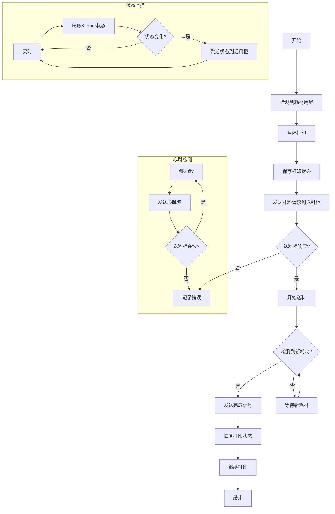

这个流程图展示了：

1. 主要流程：
   - 检测耗材用尽
   - 暂停打印并保存状态
   - 发送补料请求
   - 等待送料柜响应
   - 监测新耗材
   - 恢复打印

2. 错误处理：
   - 送料柜无响应处理
   - 错误记录和用户通知
   - 错误恢复流程

3. 并行监控：
   - 心跳检测（每30秒）
   - 状态监控（每5秒）

4. 状态转换：
   - 正常流程的状态转换
   - 错误情况的状态转换
   - 恢复流程的状态转换

这个流程确保了：
- 打印过程的连续性
- 系统状态的实时监控
- 错误的及时处理
- 用户的及时通知
- 自动恢复的可能性
