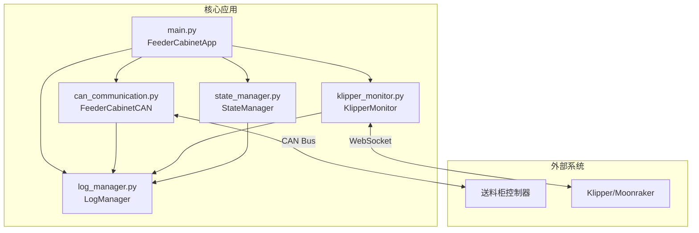

# 送料柜自动续料系统 - 项目架构文档

## 一、项目概述

送料柜自动续料系统是一个基于Python的3D打印机自动化系统，通过CAN总线与送料柜控制器通信，实现断料检测、自动暂停、请求送料、恢复打印的完整自动化流程。系统采用事件驱动的异步架构，具备自动重连、错误恢复等高可用性特性。

## 二、目录结构

```
feeder_cabinet/
├── config/                         # 配置文件目录
│   └── config.yaml                # 主配置文件
│
├── doc/                           # 文档目录
│   ├── API_Server.md             # API服务器文档
│   ├── server.md                 # 服务器文档
│   ├── 断料续打流程.md           # 断料续打流程说明
│   ├── 系统设计.md               # 系统设计文档
│   ├── 通信协议.md               # 通信协议文档
│   └── 项目架构.md               # 本文档
│
├── scripts/                       # 脚本和配置文件
│   ├── install.sh                # 自动安装脚本
│   ├── install_can1.sh           # CAN接口安装脚本
│   ├── can1                      # CAN接口配置文件
│   ├── can_rename.sh             # CAN设备重命名脚本
│   ├── 75-can-custom.rules       # udev规则文件
│   └── feeder_cabinet.service    # systemd服务文件
│
├── src/feeder_cabinet/           # 源代码目录
│   ├── __init__.py              # 包初始化文件
│   ├── __main__.py              # 包执行入口
│   ├── main.py                  # 主程序入口
│   ├── can_communication.py     # CAN通信模块
│   ├── klipper_monitor.py       # Klipper监控模块
│   ├── state_manager.py         # 状态管理模块
│   └── log_manager.py           # 日志管理模块
│
├── tests/                        # 测试目录
│   └── test_state_manager.py    # 状态管理器测试
│
├── CLAUDE.md                     # Claude AI指导文档
├── LICENSE                       # 许可证文件
├── README.md                     # 项目说明文档
├── setup.py                      # Python包安装配置
├── debug_start.py                # 调试启动脚本
└── start_feeder_cabinet.py       # 生产启动脚本
```

## 三、核心模块详解

### 3.1 主程序模块 (main.py)

**类名**: `FeederCabinetApp`

**职责**:
- 应用程序生命周期管理
- 组件初始化和协调
- 事件处理和状态转换
- 配置管理

**核心方法**:
```python
- __init__(config_path, verbose)    # 构造函数，初始化应用
- init()                           # 初始化各个组件
- start()                          # 启动应用程序
- stop()                           # 停止应用程序
- run()                            # 主事件循环
- _handle_filament_status_query()  # 处理挤出机状态查询
- _handle_klipper_status_update()  # 处理Klipper状态更新
- _on_state_changed()              # 状态变化回调处理
```

**关键流程**:
1. 加载配置文件
2. 初始化日志系统
3. 创建CAN通信和Klipper监控实例
4. 注册回调函数
5. 启动异步任务
6. 进入事件循环

### 3.2 CAN通信模块 (can_communication.py)

**类名**: `FeederCabinetCAN`

**职责**:
- CAN总线连接管理
- 消息收发和协议解析
- 自动重连机制
- 心跳维持

**核心方法**:
```python
- connect()                        # 连接CAN总线并握手
- disconnect()                     # 断开连接
- reconnect()                      # 重新连接
- send_message(msg_type, data)     # 发送CAN消息
- request_feed(extruder)           # 请求送料
- send_filament_status_response()  # 发送挤出机状态
- _perform_handshake()             # 执行握手协议
- _receive_loop()                  # 异步接收循环
- _heartbeat_loop()                # 心跳发送循环
```

**协议定义**:
- 发送ID: 0x10A (打印机→送料柜)
- 接收ID: 0x10B (送料柜→打印机)
- 握手ID: 0x3F0/0x3F1
- 命令类型:
  - 0x01: 请求送料
  - 0x03: 查询挤出机状态
  - 0x04-0x09: 打印状态通知
  - 0x0A: 料管映射查询
  - 0x0B: 料管映射响应
  - 0x0C: 料管映射设置

### 3.3 Klipper监控模块 (klipper_monitor.py)

**类名**: `KlipperMonitor`

**职责**:
- Moonraker WebSocket连接管理
- 实时状态监控
- G-code命令执行
- 断料检测

**核心方法**:
```python
- connect()                        # 连接Moonraker
- disconnect()                     # 断开连接
- start_monitoring(interval)       # 开始监控
- pause_print()                    # 暂停打印
- resume_print()                   # 恢复打印
- cancel_print()                   # 取消打印
- get_printer_status()             # 获取打印机状态
- get_filament_status()            # 获取断料传感器状态
- register_status_callback()       # 注册状态回调
- _ws_handler()                    # WebSocket处理循环
- _subscribe_objects()             # 订阅Klipper对象
```

**监控对象**:
- print_stats: 打印统计信息
- toolhead: 工具头状态
- extruder/extruder1: 挤出机状态
- filament_switch_sensor: 断料传感器

### 3.4 状态管理模块 (state_manager.py)

**类名**: `StateManager`

**职责**:
- 系统状态的中央管理
- 状态转换的原子性保证
- 状态变化通知

**系统状态**:
```python
class SystemStateEnum(Enum):
    STARTING = "starting"          # 启动中
    IDLE = "idle"                  # 空闲
    PRINTING = "printing"          # 打印中
    PAUSED = "paused"              # 已暂停
    RUNOUT = "runout"              # 断料
    FEEDING = "feeding"            # 送料中
    RESUMING = "resuming"          # 恢复打印中
    ERROR = "error"                # 错误状态
    DISCONNECTED = "disconnected"  # 连接断开
```

**核心方法**:
```python
- transition_to(new_state, **payload)  # 状态转换
- is_state(state)                      # 检查当前状态
- get_payload()                        # 获取状态附加信息
- set_state_change_callback()          # 设置状态变化回调
```

### 3.5 日志管理模块 (log_manager.py)

**类名**: `LogManager`

**职责**:
- 日志文件管理
- 日志轮转和清理
- 多级别日志输出

**核心方法**:
```python
- setup_logger(name, config)           # 设置日志记录器
- get_child_logger(suffix)             # 获取子记录器
- update_log_level(level)              # 更新日志级别
- cleanup_old_logs()                   # 清理过期日志
- get_log_stats()                      # 获取日志统计
- archive_logs()                       # 归档日志文件
```

## 四、系统架构图

### 4.1 模块依赖关系



### 4.2 异步任务架构

```
应用程序异步任务树:
├── main.py.run()                        [主事件循环]
│   ├── CAN通信任务组
│   │   ├── CAN._receive_loop()          [CAN接收循环]
│   │   ├── CAN._heartbeat_loop()        [CAN心跳循环]
│   │   └── main._can_reconnect_task()   [CAN重连任务]
│   │
│   └── Klipper监控任务组
│       ├── KlipperMonitor._ws_handler() [WebSocket处理]
│       └── 内置自动重连机制
│
└── LogManager.cleanup_thread             [日志清理线程]
```

### 4.3 状态转换流程

```
STARTING ──init()──> IDLE ──打印开始──> PRINTING
   │                   │                    │
   └──错误──> ERROR    │                    ├──断料──> T1_RUNOUT/T2_RUNOUT
                       │                    │              │
                       └────<恢复完成>──────┘              ├──暂停──> PAUSED
                                                          │              │
                                                          └──请求送料──> FEEDING
                                                                         │
                                                          RESUMING <──送料完成──┘
```

## 五、关键业务流程

### 5.1 系统启动流程

```sequence
1. 加载配置文件 (config.yaml)
2. 初始化日志系统
3. 创建状态管理器 (STARTING状态)
4. 初始化CAN通信
   - 连接CAN总线
   - 执行握手协议
   - 启动接收/心跳任务
5. 初始化Klipper监控
   - 连接Moonraker WebSocket
   - 订阅状态更新
6. 注册回调函数
7. 转换到IDLE状态
8. 进入主事件循环
```

### 5.2 断料处理流程

```sequence
1. Klipper检测到断料
   → filament_switch_sensor.filament_detected = False
   
2. KlipperMonitor捕获状态变化
   → 调用main.py注册的status_callback
   
3. main.py分析断料状态
   → 确定是哪个挤出机断料
   → 状态转换: PRINTING → T1_RUNOUT/T2_RUNOUT
   
4. 状态变化触发动作
   → 暂停打印 (G-code: PAUSE)
   → 状态转换: T1_RUNOUT → PAUSED
   
5. 请求送料
   → CAN发送请求送料命令 (0x01)
   → 状态转换: PAUSED → FEEDING
   
6. 等待送料完成
   → 送料柜发送完成信号
   → 恢复打印 (G-code: RESUME)
   → 状态转换: FEEDING → RESUMING → PRINTING
```

### 5.3 通信协议流程

```sequence
送料柜查询挤出机状态:
1. 送料柜 → 打印机: 0x10B [0x03]
2. main.py处理查询请求
3. 获取Klipper断料传感器状态
4. 打印机 → 送料柜: 0x10A [0x04, status_bitmap]

打印机请求送料:
1. 检测到断料事件
2. 打印机 → 送料柜: 0x10A [0x01, extruder_id]
3. 送料柜执行送料动作
4. 送料柜 → 打印机: 0x10B [完成信号]
```

## 六、配置说明

### 6.1 主配置文件 (config.yaml)

```yaml
# CAN通信配置
can:
  interface: can1              # CAN接口名称
  bitrate: 1000000            # 波特率 (1Mbps)
  send_timeout: 1.0           # 发送超时
  retry_count: 3              # 重试次数

# Klipper连接配置  
klipper:
  moonraker_url: http://localhost:7125  # Moonraker API地址
  update_interval: 0.5                   # 状态更新间隔(秒)

# 断料检测配置
filament_runout:
  enabled: true               # 是否启用
  sensors:                    # 传感器列表
    - Filament_Sensor0
    - Filament_Sensor1

# 挤出机映射
extruder_mapping:
  default_active: 0           # 默认活跃挤出机
  tube_mapping:              # 料管映射
    0: 0                     # 挤出机0 -> 料管0
    1: 1                     # 挤出机1 -> 料管1

# 日志配置
logging:
  level: INFO                # 日志级别
  log_dir: /home/mingda/printer_data/logs
  max_size_mb: 10           # 单文件最大大小
  backup_count: 5           # 保留文件数
  retention_days: 30        # 日志保留天数
```

### 6.2 环境要求

- Python 3.7+
- asyncio支持
- CAN总线硬件支持
- Klipper固件 + Moonraker API

### 6.3 依赖包

```
python-can        # CAN总线通信
websockets        # WebSocket客户端
aiohttp          # 异步HTTP客户端
pyyaml           # YAML配置解析
```

## 七、部署架构

```
┌─────────────────┐     ┌─────────────────┐     ┌─────────────────┐
│   3D打印机主板   │     │  Raspberry Pi    │     │   送料柜控制器   │
│   (Klipper)     │<--->│  (本系统)        │<--->│                 │
└─────────────────┘     └─────────────────┘     └─────────────────┘
      UART/USB            CAN Bus (1Mbps)           CAN Bus
                          WebSocket (7125)
```

## 八、扩展性设计

1. **模块化架构**: 各模块职责单一，易于扩展
2. **回调机制**: 松耦合设计，便于添加新功能
3. **配置驱动**: 通过配置文件调整行为
4. **异步设计**: 支持高并发和实时响应
5. **标准协议**: 使用标准CAN和WebSocket协议

## 九、维护和监控

### 9.1 日志文件

- 应用日志: `/home/mingda/printer_data/logs/feeder_cabinet.log`
- 系统日志: `journalctl -u feeder_cabinet`
- CAN日志: `/home/mingda/tmp/can_rename.log`

### 9.2 监控命令

```bash
# 查看服务状态
systemctl status feeder_cabinet

# 实时日志
journalctl -u feeder_cabinet -f

# CAN总线监控
candump can1 | grep -E "(10A|10B)"

# 查看进程
ps aux | grep feeder_cabinet
```

### 9.3 调试模式

```bash
# 详细日志模式
python3 start_feeder_cabinet.py -v

# 调试启动
python3 debug_start.py
```

## 十、版本信息

- 创建日期: 2025-01-08
- 版本: 1.0.0
- 作者: 明达科技
- 许可: MIT License